# W7 Evidence Pack — BudgetBot AI Money Coach

## 1. Project Summary

**BudgetBot** is a FinTech AI Money Coach deployed on AWS. The application allows users to sign in, upload bank statement files, automatically parse transactions from CSV/PDF, store user-specific financial data, view spending summaries, ask AI financial questions, and receive budget cap alerts when spending exceeds user-defined limits.

This document records the final working implementation and the evidence screenshots required for submission. It does not document intermediate debugging steps.

Final deployment stack:

- **Frontend:** React/Vite static site hosted on S3 and served through CloudFront.
- **Authentication:** Amazon Cognito Hosted UI for login/sign-up and per-user isolation.
- **API:** API Gateway integrated with `budgetbot-api` Lambda.
- **Storage:** S3 bucket for uploaded statement files.
- **Queue:** SQS queue for asynchronous parsing jobs.
- **Parser:** `BudgetBot_Parser_Lambda` for CSV/PDF parsing.
- **Database:** RDS PostgreSQL database `budgetbot`.
- **AI:** Amazon Bedrock for AI-backed classification/chat.
- **Alerting:** Budget cap check and SNS email alert.
- **Security:** KMS encryption, SSM Parameter Store SecureString, Cognito, least-privilege IAM.
- **Observability:** CloudWatch Logs and parser latency metric.

---

## 2. Public Access and Main AWS Resources

| Item | Value |
|---|---|
| Public frontend URL | `https://d2ydgy93m4rrer.cloudfront.net/` |
| API base URL | `https://k2i1ih1613.execute-api.ap-southeast-1.amazonaws.com` |
| AWS Region | `ap-southeast-1` |
| API Lambda | `budgetbot-api` |
| Parser Lambda | `BudgetBot_Parser_Lambda` |
| Budget alert Lambda | `budgetbot-budget-handler` |
| S3 upload bucket | `budgetbot-statements-459983119471` |
| SQS queue | `budgetbot-file-queue` |
| RDS database | `budgetbot` |
| Cognito user pool | `budgetbot-users` |
| Cognito app client | `budgetbot-web` |
| SSM DB URL parameter | `/budgetbot/postgres_url` |

**Evidence**

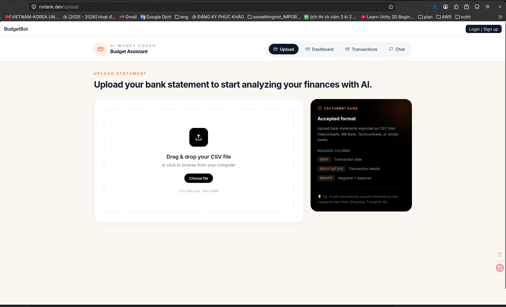

---

## 3. Architecture Overview

```text
User Browser
    |
    | HTTPS
    v
CloudFront
    |
    v
S3 Static Frontend Assets
    |
    | API requests with Cognito token + X-User-Id
    v
API Gateway
    |
    v
budgetbot-api Lambda
    |
    |-- Upload file to S3
    |-- Send parse job to SQS
    |-- Read/write RDS PostgreSQL
    |-- Invoke Bedrock for AI features
    |
    v
SQS budgetbot-file-queue
    |
    v
BudgetBot_Parser_Lambda
    |
    |-- Read CSV/PDF from S3
    |-- Parse transactions
    |-- Insert transactions to RDS
    |-- Update file status
    |-- Invoke budgetbot-budget-handler
    |
    v
budgetbot-budget-handler Lambda
    |
    |-- Check user budget caps
    |-- Publish SNS alert if exceeded
    v
SNS Email Alert
```

**Evidence**

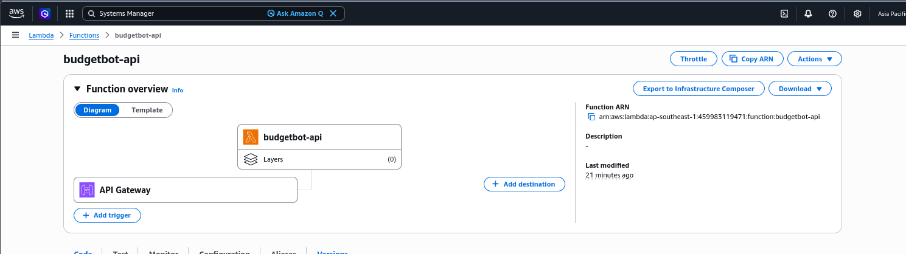

---

## 4. Requirement Coverage

| Requirement area | BudgetBot implementation |
|---|---|
| Public deployed app | CloudFront HTTPS frontend |
| Compute | AWS Lambda for API, parser, and budget handler |
| API layer | API Gateway endpoints for health, upload, summary, transactions, chat, budget caps |
| Persistent database | RDS PostgreSQL database `budgetbot` |
| Object storage | S3 stores uploaded CSV/PDF statements |
| AI/ML | Amazon Bedrock AI backend |
| Authentication | Amazon Cognito Hosted UI login/sign-up |
| User separation | Cognito `sub` is used as `user_id` |
| Security | KMS, SSM SecureString, least-privilege IAM, Cognito |
| Monitoring | CloudWatch Logs and parser latency metric |
| Cost control | Budget/cost screenshots and architecture designed under $100 cap |

---

## 5. Authentication and User Separation

BudgetBot uses Cognito Hosted UI for login/sign-up. After login, the frontend stores Cognito token information and uses the Cognito `sub` as the application user ID.

API requests include:

```text
Authorization: Bearer <Cognito ID token>
X-User-Id: <Cognito sub>
```

Database checks showed different users have separate files and transactions.

**Evidence**

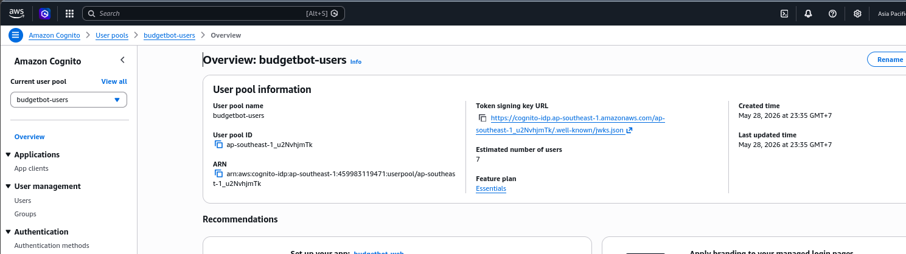

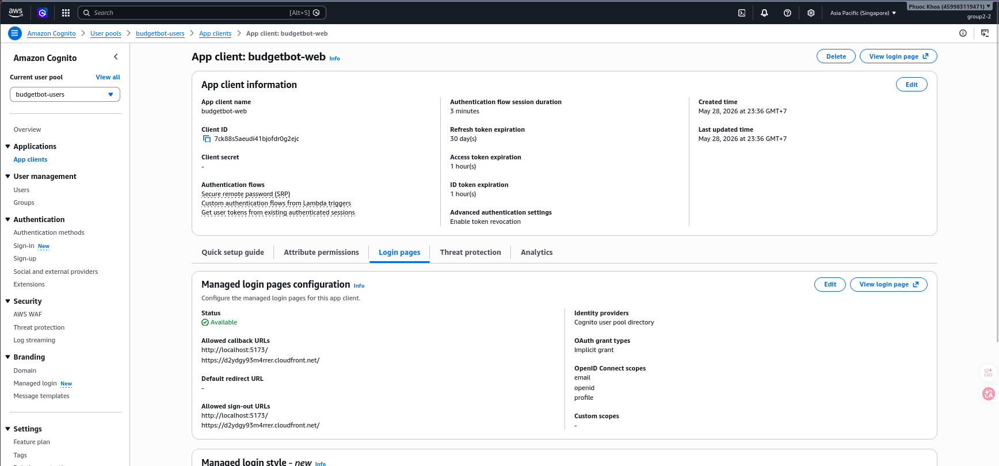

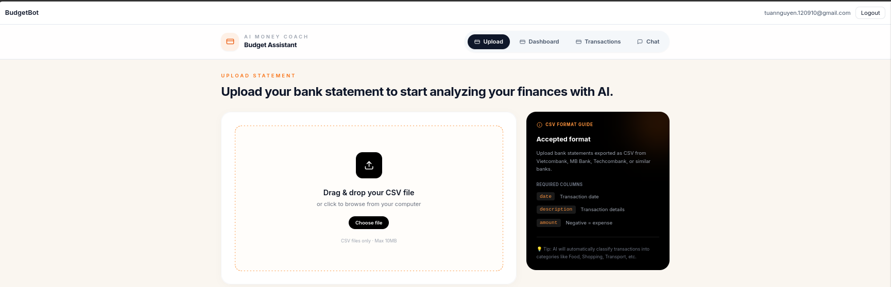

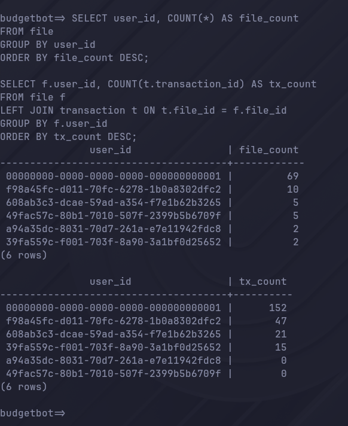

---

## 6. File Upload: CSV and PDF Support

BudgetBot supports both `.csv` and `.pdf` upload.

Final upload flow:

1. User uploads CSV/PDF from frontend or API.
2. `budgetbot-api` stores the file in S3.
3. `budgetbot-api` creates a file record in RDS.
4. `budgetbot-api` sends a parsing job to SQS.
5. `BudgetBot_Parser_Lambda` consumes the SQS message.
6. Parser reads the file from S3.
7. Parser extracts transactions.
8. Parser inserts transactions into RDS.
9. Parser updates file status to `done`.
10. Parser invokes `budgetbot-budget-handler`.

Successful PDF evidence:

```text
file_id: ce9626c0-2392-41a5-a1ec-a7e66b1910d2
file_name: uploads/f98a45fc-d011-70fc-6278-1b0a8302dfc2/sample_transactions.pdf
status: done
tx_count: 5
```

Another successful API upload returned:

```text
file_id: 2792d81b-81e9-4e40-af6b-f9f4ee90a347
status: pending
stored_at: s3://budgetbot-statements-459983119471/uploads/f98a45fc-d011-70fc-6278-1b0a8302dfc2/sample_transactions.pdf
```

**Evidence**

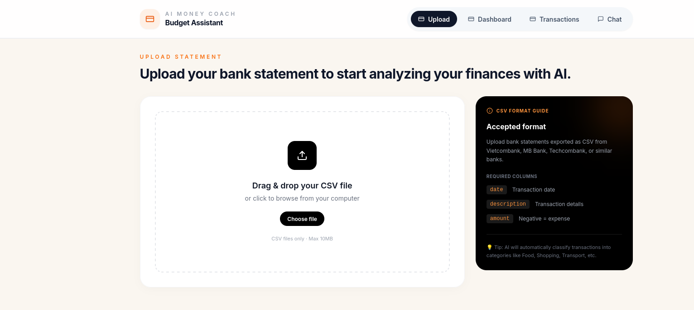

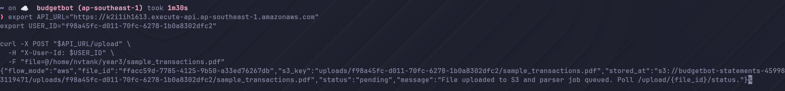

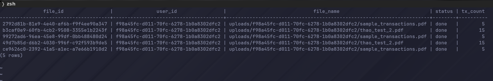

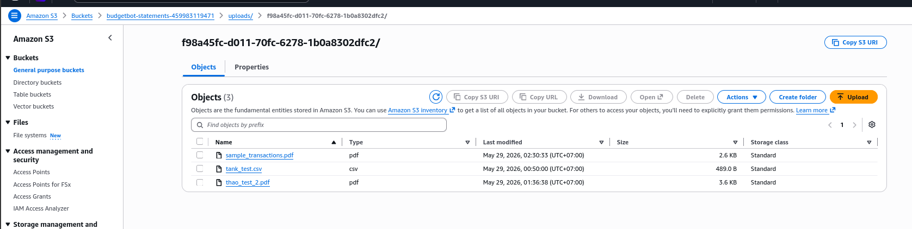

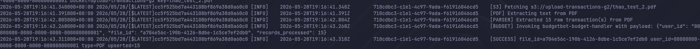

---

## 7. Database Persistence

BudgetBot stores application state in RDS PostgreSQL database `budgetbot`.

Main tables:

| Table | Purpose |
|---|---|
| `user` | Application users and budget data |
| `file` | Uploaded statement metadata and processing status |
| `transaction` | Parsed transaction records |
| `budget_cap` | User-defined category spending caps |
| `chat_history` | AI chat history |

Transaction uniqueness rule:

```sql
CREATE UNIQUE INDEX uq_transaction_file_bank_id
ON transaction(file_id, bank_id);
```

This allows each file to have its own transaction numbering without conflicts across uploaded files.

**Evidence**

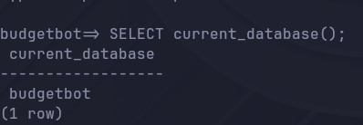

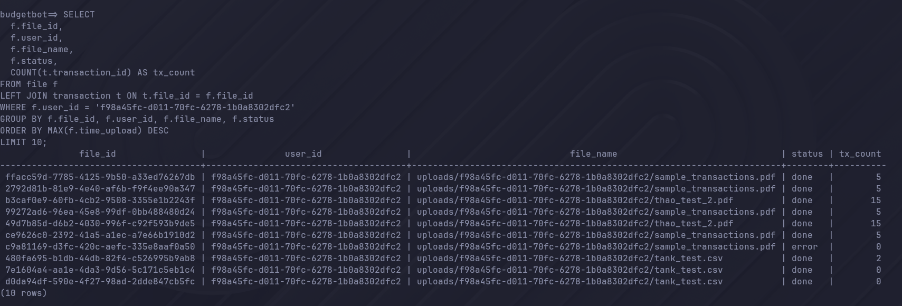

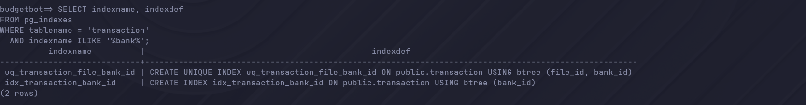

---

## 8. API Verification

### Health Check

```bash
curl "$API_URL/health"
```

Expected output:

```json
{"status":"ok","flow_mode":"aws","backends":{"ai":"bedrock","storage":"s3","db":"postgres"}}
```

### Summary API

```bash
curl "$API_URL/summary" \
  -H "X-User-Id: $USER_ID"
```

### Transactions API

```bash
curl "$API_URL/transactions" \
  -H "X-User-Id: $USER_ID"
```

**Evidence**

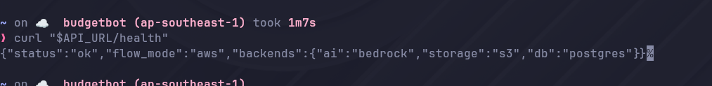

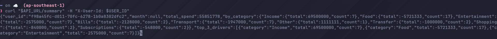

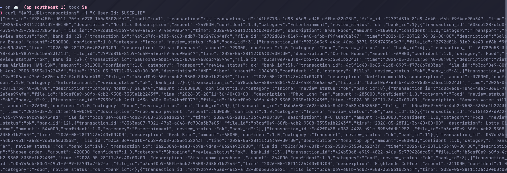

---

## 9. Budget Cap Alarm and SNS Alert

BudgetBot supports user-defined category budget caps. A user can set a cap such as:

```text
Category: Food
Cap amount: 2,000,000 VND
```

When parsed transactions exceed a cap, `budgetbot-budget-handler` checks spending and sends an SNS alert.

Budget check command:

```bash
curl -X POST "$API_URL/budget/check" \
  -H "X-User-Id: $USER_ID" \
  -H "Content-Type: application/json"
```

Example output:

```json
{
  "details": [
    {
      "category": "Food",
      "cap_amount": 2000000,
      "spent": 37515567,
      "status": "exceeded"
    }
  ]
}
```

**Evidence**

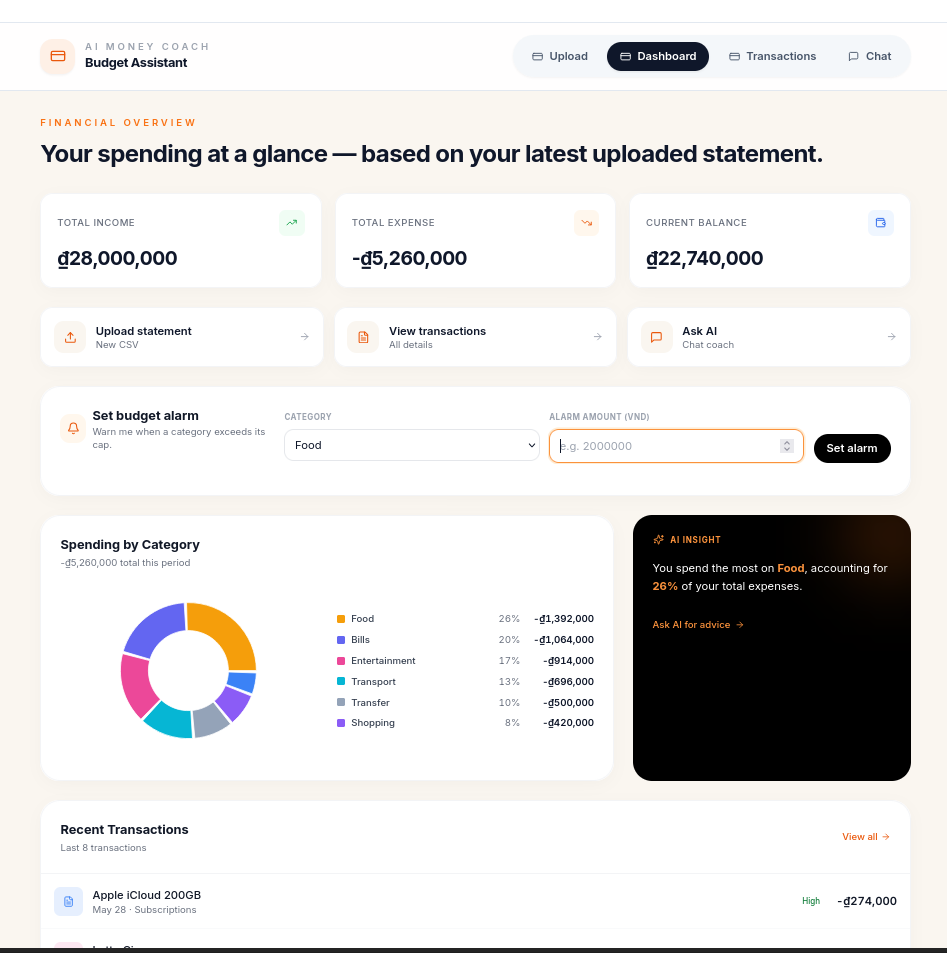

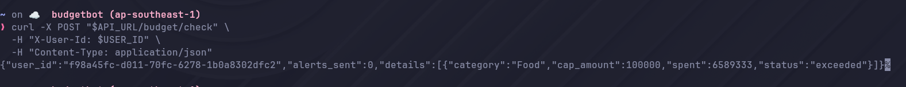

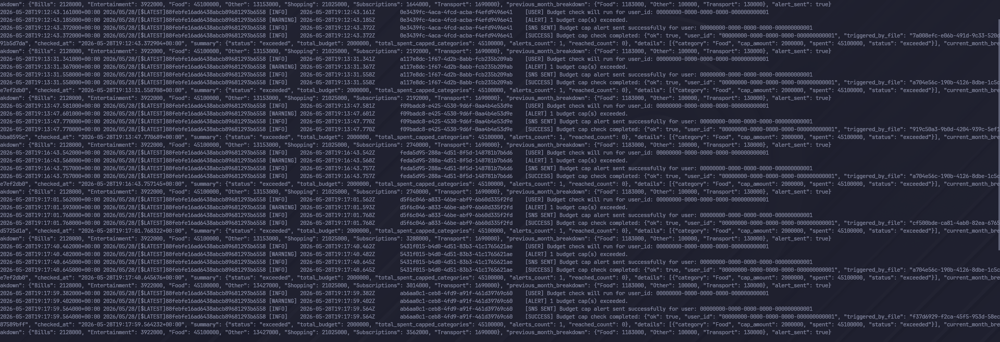

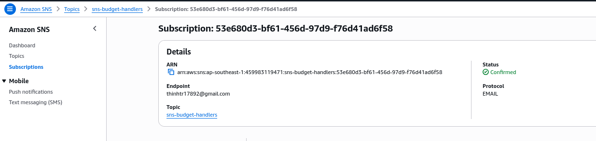

---

## 10. AI Features with Amazon Bedrock

The deployed API uses Amazon Bedrock as the AI backend.

Final environment values include:

```text
AI_BACKEND=bedrock
AI_MODEL_ID=apac.amazon.nova-micro-v1:0
```

AI-backed features:

- Transaction classification.
- AI chat assistant.
- Spending insight generation.

**Evidence**


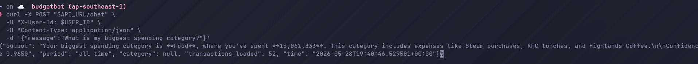

---

## 11. Security Implementation

### 11.1 Cognito Authentication

Cognito Hosted UI is used for login/sign-up. The frontend shows the logged-in user and sends Cognito token information with API requests.

### 11.2 SSM SecureString for DB URL

The database URL was moved out of Lambda environment variables. Final Lambda API environment check:

```json
{
  "DB_URL_PARAM_NAME": "/budgetbot/postgres_url",
  "HasUSERSTORE_POSTGRES_URL": false
}
```

The DB connection string is stored as:

```text
SSM Parameter Store SecureString: /budgetbot/postgres_url
KMS key: arn:aws:kms:ap-southeast-1:459983119471:key/b0b19ec3-cf84-430c-a736-3c5695fdec85
```

### 11.3 KMS Encryption

KMS is used for:

- Lambda environment variables at rest.
- SSM SecureString encryption.
- S3 object encryption.

### 11.4 Least-Privilege IAM

The API Lambda role is limited to required permissions for:

- S3 upload to `budgetbot-statements-459983119471/uploads/*`
- SQS send message to `budgetbot-file-queue`
- KMS usage for encrypted S3 upload
- Bedrock model invocation
- SSM read for `/budgetbot/postgres_url`
- KMS decrypt for Parameter Store
- CloudWatch logs
- VPC ENI access

IAM simulator verified:

```text
s3:PutObject      allowed
sqs:SendMessage   allowed
```

The real upload test after removing `USERSTORE_POSTGRES_URL` verified that the API can still read DB config securely from SSM and upload files correctly.

**Evidence**

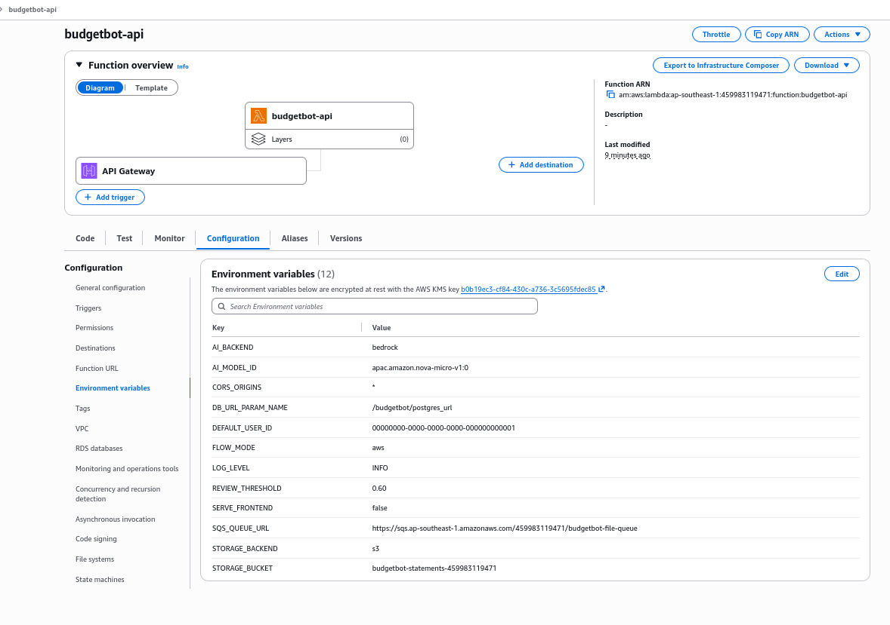


---

## 12. Monitoring and Observability

CloudWatch Logs are used for all key Lambdas:

| Log Group | Purpose |
|---|---|
| `/aws/lambda/budgetbot-api` | API, upload, DB, and Bedrock logs |
| `/aws/lambda/BudgetBot_Parser_Lambda` | SQS, S3 fetch, CSV/PDF parse, DB insert |
| `/aws/lambda/budgetbot-budget-handler` | Budget cap checks and SNS alerts |

Parser Lambda also emits a custom metric:

```text
ParsingLatency
```

**Evidence**

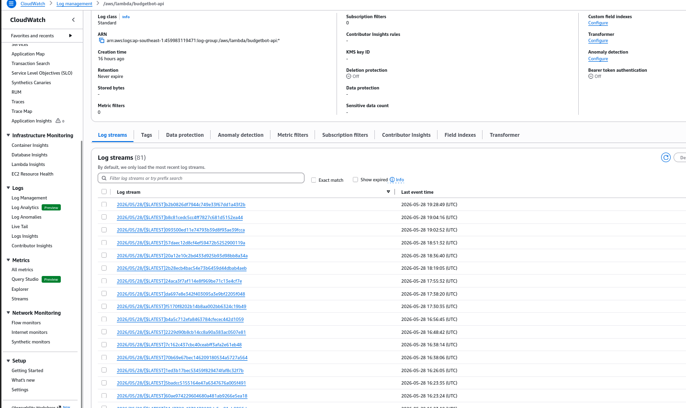

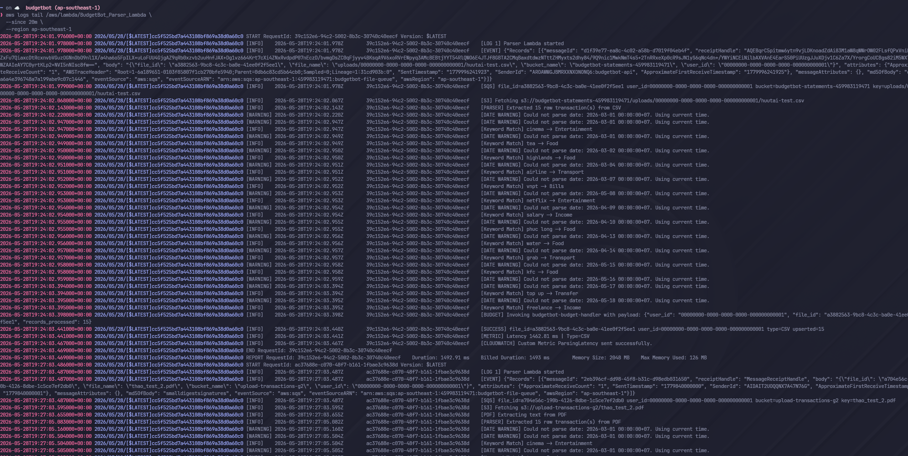

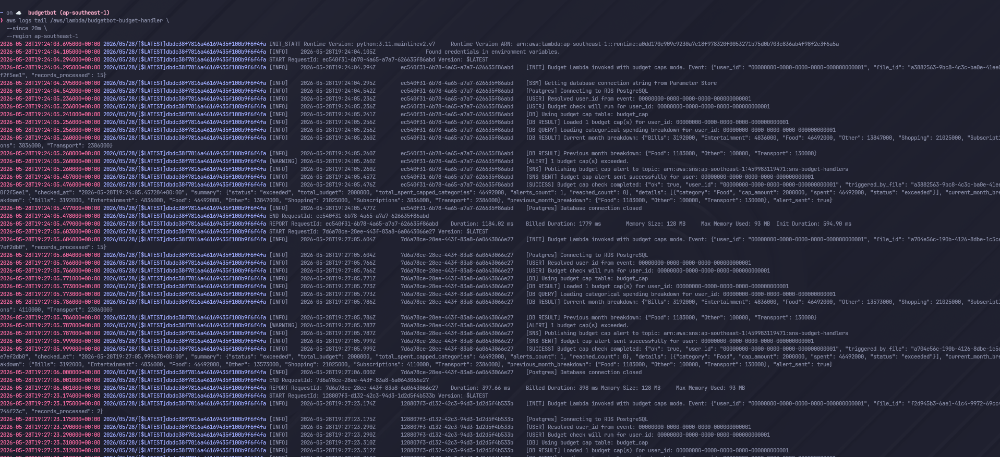


---

## 13. Cost Control and Budget Compliance

The W7 hard cap is:

```text
$100 HARD CAP / group
```

BudgetBot is designed to stay under the cap by using:

- Lambda instead of always-on compute.
- S3 for object storage.
- RDS Single-AZ for hackathon usage.
- SQS for asynchronous processing.
- Bedrock only for necessary AI calls.
- No unnecessary high fixed-cost services.
- Budget/cost monitoring screenshots.

Reference W7 estimate for BudgetBot in `ap-southeast-1`:

```text
~$3.65 for 48-hour hackathon usage
```

**Evidence**


---

## 14. Final Validation Checklist

| Check | Status |
|---|---|
| Public frontend through CloudFront HTTPS | Done |
| Cognito login/sign-up | Done |
| Cognito user separation | Done |
| CSV upload | Done |
| PDF upload | Done |
| S3 object storage | Done |
| SQS parser queue | Done |
| Parser Lambda PDF extraction | Done |
| RDS transaction persistence | Done |
| `/health` API | Done |
| `/summary` API | Done |
| `/transactions` API | Done |
| Budget cap setting | Done |
| Budget handler invoke after parsing | Done |
| SNS alert sent when cap exceeded | Done |
| DB URL stored in SSM SecureString | Done |
| Lambda env no longer contains `USERSTORE_POSTGRES_URL` | Done |
| API still works after secret removal | Done |
| Least-privilege IAM direction | Done |
| CloudWatch logs available | Done |
| Cost evidence screenshots | Pending screenshots |
| Teardown plan | Done |

---

## 15. Screenshot Capture Guide

Create the folder:

```bash
mkdir -p docs/evidence/images
```

Save screenshots with the exact names below.

### Frontend screenshots

| File name | Capture this |
|---|---|
| `01_frontend_public_url.png` | Browser at `https://d2ydgy93m4rrer.cloudfront.net/` with HTTPS visible |
| `05_frontend_logged_in_user.png` | Top bar showing logged-in Cognito email |
| `07_frontend_upload_page.png` | Upload page showing CSV/PDF upload UI |
| `18_frontend_budget_alarm.png` | Dashboard budget alarm section |
| `23_frontend_ai_chat.png` | Chat page with AI response |

### Cognito screenshots

| File name | Capture this |
|---|---|
| `03_cognito_user_pool.png` | Cognito user pool `budgetbot-users` |
| `04_cognito_app_client_callback_urls.png` | App client `budgetbot-web` callback/logout URLs |

### Lambda/API screenshots

| File name | Capture this |
|---|---|
| `02_lambda_api_overview.png` | Lambda `budgetbot-api` overview with API Gateway trigger |
| `15_api_health.png` | Terminal output of `curl "$API_URL/health"` |
| `16_api_summary.png` | Terminal output of `curl "$API_URL/summary"` |
| `17_api_transactions.png` | Terminal output of `curl "$API_URL/transactions"` |
| `22_lambda_ai_env_settings.png` | Lambda env showing `AI_BACKEND=bedrock` and `AI_MODEL_ID` |
| `25_lambda_env_secure_no_db_url.png` | Lambda env showing `DB_URL_PARAM_NAME`, no `USERSTORE_POSTGRES_URL` |

### Upload/S3/Parser screenshots

| File name | Capture this |
|---|---|
| `08_pdf_upload_api_response.png` | Terminal upload response with `status: pending` |
| `09_pdf_upload_done_db.png` | SQL result showing PDF `status=done`, `tx_count=5` |
| `10_s3_uploaded_pdf_object.png` | S3 uploaded PDF object under user prefix |
| `11_parser_pdf_success_logs.png` | Parser logs showing PDF extraction and success |
| `32_cloudwatch_parser_logs.png` | Broader parser logs showing SQS event, S3 fetch, parse, insert |

### Database screenshots

| File name | Capture this |
|---|---|
| `12_rds_budgetbot_database.png` | psql connected to database `budgetbot` |
| `13_db_file_transaction_counts.png` | SQL file count and transaction count output |
| `14_db_transaction_unique_index.png` | SQL output showing `uq_transaction_file_bank_id` |
| `06_db_user_separation.png` | SQL output grouped by `user_id` |

### Budget alert screenshots

| File name | Capture this |
|---|---|
| `19_budget_check_api_output.png` | POST `/budget/check` output |
| `20_budget_handler_sns_sent_logs.png` | Budget handler logs showing exceeded cap and SNS sent |
| `21_sns_topic_subscription.png` | SNS topic with confirmed subscription |
| `33_cloudwatch_budget_handler_logs.png` | Broader budget handler logs |

### Security screenshots

| File name | Capture this |
|---|---|
| `26_ssm_securestring_postgres_url.png` | SSM Parameter `/budgetbot/postgres_url`, Type `SecureString` |
| `27_iam_api_role_policies.png` | IAM role `BudgetBotApiLambdaRole` policies |
| `28_iam_simulator_s3_sqs_allowed.png` | IAM simulator output showing S3/SQS allowed |
| `29_kms_key.png` | KMS key page |
| `30_s3_bucket_encryption.png` | S3 bucket default encryption |

### Monitoring and cost screenshots

| File name | Capture this |
|---|---|
| `31_cloudwatch_api_logs.png` | CloudWatch logs for `budgetbot-api` |
| `34_cloudwatch_parsing_latency_metric.png` | CloudWatch `ParsingLatency` metric |
| `35_cost_explorer_day1.png` | Cost Explorer Day 1 EOD |
| `36_cost_explorer_day2.png` | Cost Explorer Day 2 EOD |
| `37_cost_explorer_friday_predemo.png` | Cost Explorer Friday pre-demo |
| `38_budget_alert_80_usd.png` | AWS Budget alert at $80 |
| `39_cost_anomaly_detection.png` | Cost Anomaly Detection setup |

---

## 16. Useful Commands for Evidence

### Set variables

```bash
export API_URL="https://k2i1ih1613.execute-api.ap-southeast-1.amazonaws.com"
export USER_ID="f98a45fc-d011-70fc-6278-1b0a8302dfc2"
```

### Health

```bash
curl "$API_URL/health"
```

### Summary

```bash
curl "$API_URL/summary" \
  -H "X-User-Id: $USER_ID"
```

### Transactions

```bash
curl "$API_URL/transactions" \
  -H "X-User-Id: $USER_ID"
```

### Upload PDF

```bash
curl -X POST "$API_URL/upload" \
  -H "X-User-Id: $USER_ID" \
  -F "file=@/home/nvtank/year3/sample_transactions.pdf"
```

### Check upload status

```bash
export FILE_ID="<file_id_from_upload_response>"

curl "$API_URL/upload/$FILE_ID/status" \
  -H "X-User-Id: $USER_ID"
```

### Check secure Lambda env

```bash
aws lambda get-function-configuration \
  --function-name budgetbot-api \
  --region ap-southeast-1 \
  --query "{
    DB_URL_PARAM_NAME: Environment.Variables.DB_URL_PARAM_NAME,
    HasUSERSTORE_POSTGRES_URL: contains(keys(Environment.Variables), 'USERSTORE_POSTGRES_URL')
  }" \
  --output json
```

Expected:

```json
{
  "DB_URL_PARAM_NAME": "/budgetbot/postgres_url",
  "HasUSERSTORE_POSTGRES_URL": false
}
```

### Parser logs

```bash
aws logs tail /aws/lambda/BudgetBot_Parser_Lambda \
  --since 20m \
  --region ap-southeast-1 \
  | grep -Ei "PDF|PARSER|SUCCESS|ERROR|Budget|f98a45fc"
```

### Budget handler logs

```bash
aws logs tail /aws/lambda/budgetbot-budget-handler \
  --since 20m \
  --region ap-southeast-1 \
  | grep -Ei "f98a45fc|Budget check|exceeded|SNS SENT|SUCCESS|ERROR"
```

### Database file and transaction count

```sql
SELECT 
  f.file_id,
  f.user_id,
  f.file_name,
  f.status,
  COUNT(t.transaction_id) AS tx_count
FROM file f
LEFT JOIN transaction t ON t.file_id = f.file_id
WHERE f.user_id = 'f98a45fc-d011-70fc-6278-1b0a8302dfc2'
GROUP BY f.file_id, f.user_id, f.file_name, f.status
ORDER BY MAX(f.time_upload) DESC
LIMIT 5;
```

### User separation

```sql
SELECT user_id, COUNT(*) AS file_count
FROM file
GROUP BY user_id
ORDER BY file_count DESC;

SELECT f.user_id, COUNT(t.transaction_id) AS tx_count
FROM file f
LEFT JOIN transaction t ON t.file_id = f.file_id
GROUP BY f.user_id
ORDER BY tx_count DESC;
```

### Transaction index

```sql
SELECT indexname, indexdef
FROM pg_indexes
WHERE tablename = 'transaction'
  AND indexname ILIKE '%bank%';
```

Expected:

```text
uq_transaction_file_bank_id
CREATE UNIQUE INDEX uq_transaction_file_bank_id ON public.transaction USING btree (file_id, bank_id)
```

---

## 17. Teardown Plan

After demo and evidence submission:

1. Export final Cost Explorer screenshots.
2. Confirm SNS/Budget/Cost Anomaly evidence is captured.
3. Keep evidence files in repo.
4. Delete or stop resources that are not needed after the hackathon:
   - RDS instance if no longer needed.
   - NAT Gateway if any exists.
   - OpenSearch Serverless if any exists.
   - Unused Lambda layers.
   - Unused S3 test objects if not required.
5. Verify Cost Explorer after teardown.
6. Keep screenshots and CloudWatch evidence for submission.

---

## 18. Final Notes

The final BudgetBot deployment demonstrates:

- Real AWS deployment.
- Public HTTPS frontend.
- Cognito authentication.
- Per-user data separation.
- CSV and PDF bank statement ingestion.
- Asynchronous S3 + SQS + Lambda processing.
- PostgreSQL-backed dashboard and transactions.
- AI-assisted financial analysis with Bedrock.
- Budget cap alerts through SNS.
- KMS and SSM SecureString secret handling.
- Reduced Lambda IAM permissions.
- CloudWatch-based operational visibility.
- Cost-aware design under the $100 W7 cap.
