# WEEK 7 EVIDENCE PACK: LAMBDA PARSER & FULL OBSERVABILITY

## 1. LAMBDA PARSER PIPELINE 

### 1.1. Asynchronous Data Flow Architecture
To resolve the bottlenecks associated with processing large files and invoking high-latency AI models, the system implements a fully decoupled, asynchronous architecture:
* **Upload & Trigger:** Statement files are uploaded directly by the client to the `budgetbot-statements-459983119471` bucket. Upon completion, S3 fires an `s3:ObjectCreated:*` event notification directly into an Amazon SQS queue.
* **Decoupling (Shock Absorption):** SQS acts as a durable buffer. This ensures the frontend user interface is never blocked waiting for a response, and the Lambda Parser only pulls messages when compute resources are available.

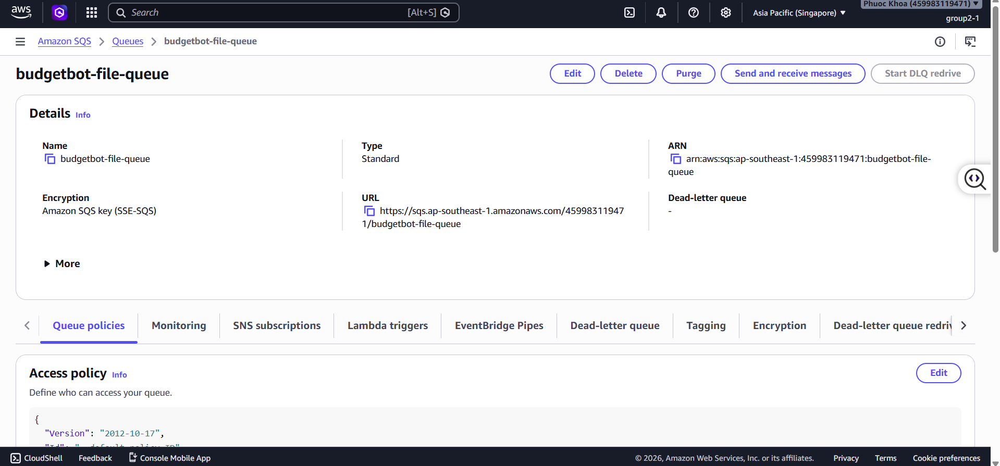

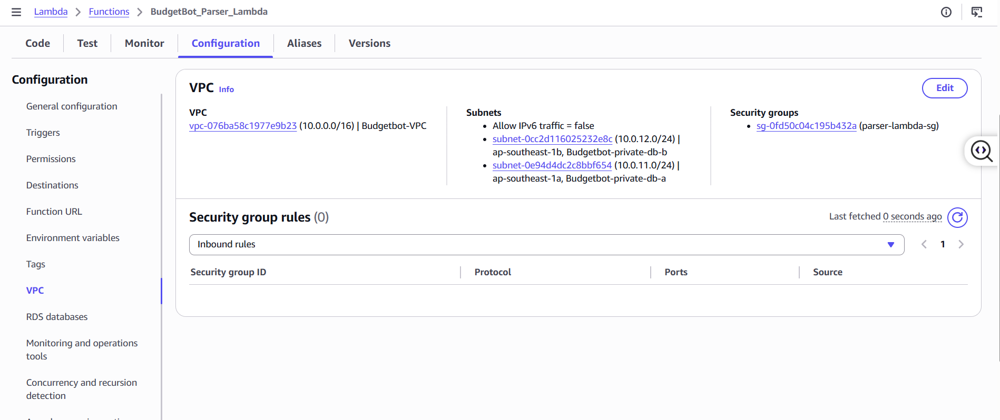
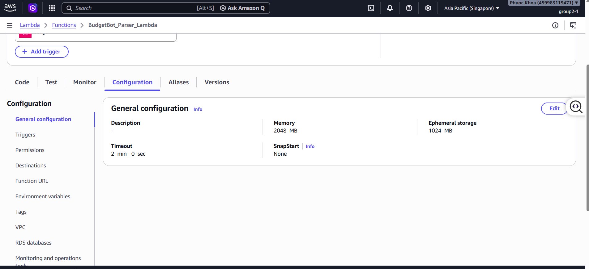
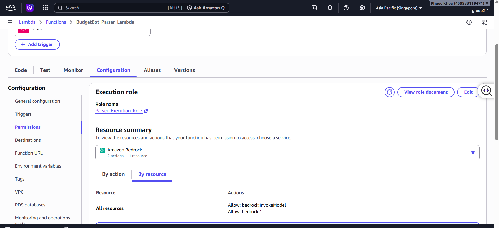

### 1.2. Parsing & Classification Strategy
The Lambda Parser supports multi-format processing using a dual-path routing strategy to optimize both cost and performance:
* **CSV Path (Deterministic):** Utilizes the `COLUMN_ALIASES` mapping matrix to dynamically resolve inconsistent Vietnamese bank header variations (e.g., "ngày gd", "số tiền", "mã gd").
* **PDF Path (AI Semantic Extraction):** Utilizes `pypdf` to extract raw text, which is then passed to Amazon Bedrock (`converse` API) using the Llama 3.1 model. The system applies **Few-Shot Prompting** to strictly format the AI's output into a standardized JSON array containing time, description, amount, and transaction ID.
* **AI Cost-Optimization (Dual-Layer):** Before invoking the LLM, transactions pass through a `KEYWORD_MAPPING` pre-filter (e.g., "grab", "shopee"). If a match is found, the category is instantly assigned with a 1.0 confidence score, bypassing expensive LLM execution cycles entirely.

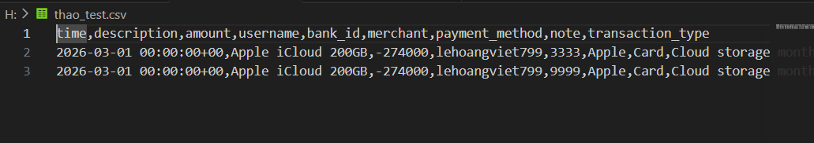
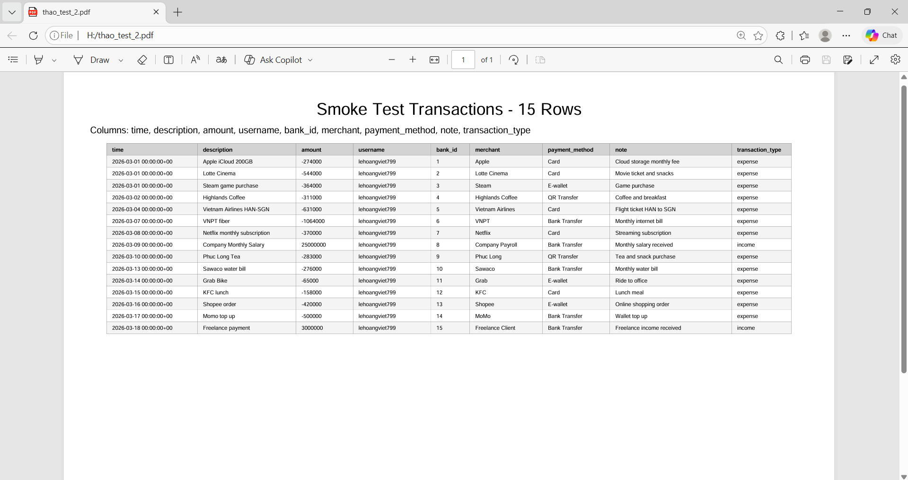

### 1.3. Idempotency & Upsert Logic
To prevent duplicate records and skewed financial budgets caused by users re-uploading the same statements, the system guarantees idempotent database writes:
* **Natural Key Algorithm:** If a native bank transaction ID is missing, the system generates a deterministic hash (`_stable_bank_id`) using a combination of the row index, description, time, and amount.
* **PostgreSQL UPSERT:** Data is persisted via RDS Proxy using the `ON CONFLICT (file_id, bank_id) DO UPDATE` command. This ensures that re-uploaded files strictly overwrite modified fields (like `review_status`) rather than inserting duplicate rows.

[code lambda](parser-lambda.txt)
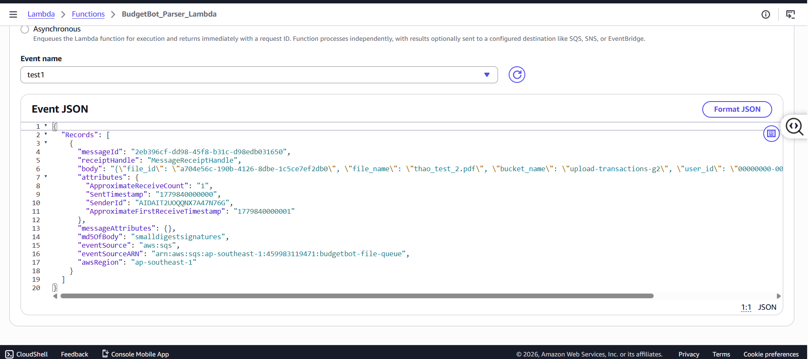
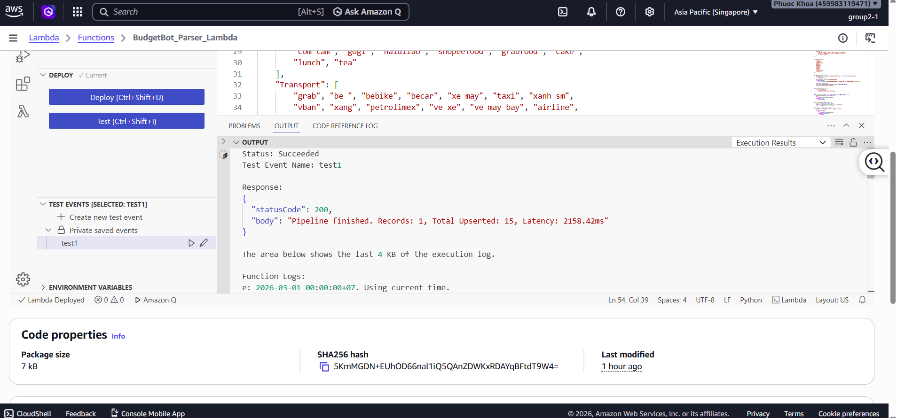
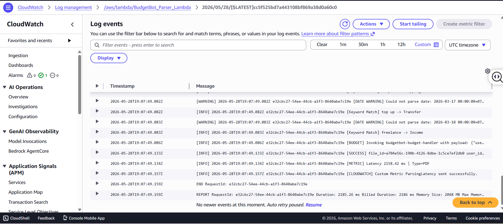

---

## 2. FULL OBSERVABILITY 

### 2.1. Secure Telemetry Network
Because the Lambda Parser is isolated inside a private VPC subnet to secure the database connection, it lacks public internet access.
* To securely transmit logs and metrics to CloudWatch, the system leverages **VPC Endpoints (Interface Endpoint on port 443)**.
* This solution routes all telemetry data purely through the internal AWS backbone, achieving full observability without the high costs or security risks associated with a NAT Gateway.

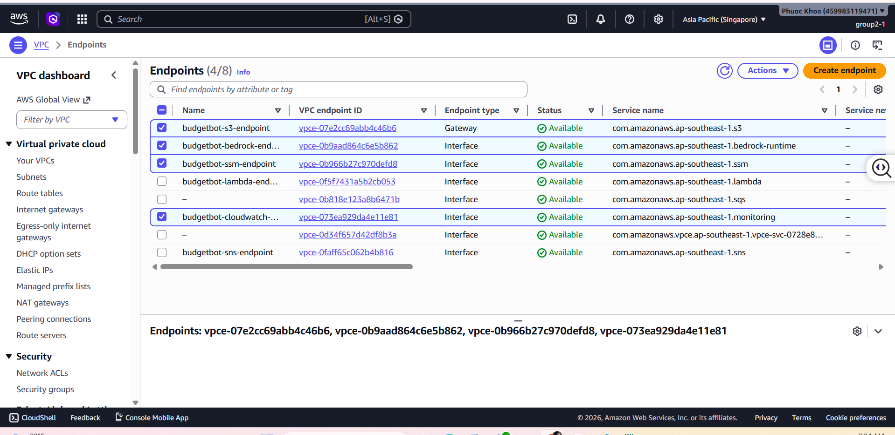

### 2.2. Custom Performance Metrics
The system utilizes Python's `time` library to benchmark the exact execution latency of the parsing pipeline.
* This execution duration is dispatched via the `cw_client.put_metric_data` API as a custom metric named `ParsingLatency` within the `BudgetBot/Pipeline` namespace.
* The metric is tagged with a `FileType` dimension (CSV or PDF), enabling fine-grained operational analysis of deterministic versus AI-driven extraction delays.

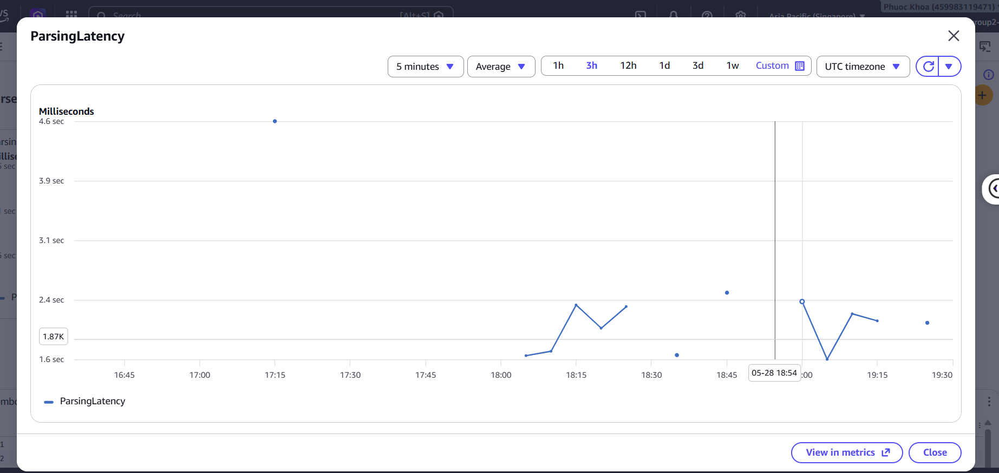

### 2.3. Alarms & Logs Insights
* **CloudWatch Alarm:** A proactive guardrail, `BudgetBot-Parser-High-Latency`, monitors the latency metric. If the average processing time exceeds 8 seconds (8000ms), the system shifts into an ALARM state. (Evidence: The alarm is currently in a stable, green `OK` state).
* **Logs Insights:** A dynamic query utilizing regex (`parse @message "Latency: * ms | Type: *" as latency, fileType`) is saved to instantly trace and debug pipeline bottlenecks from raw unstructured logs.

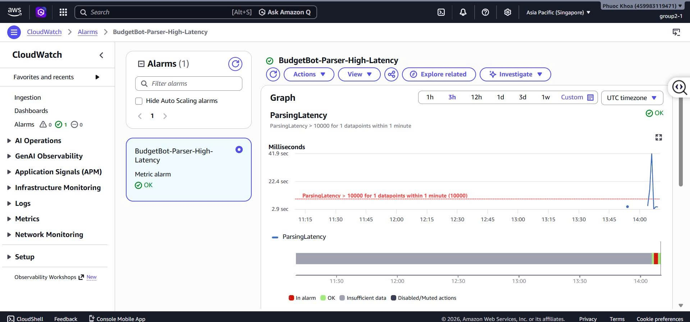
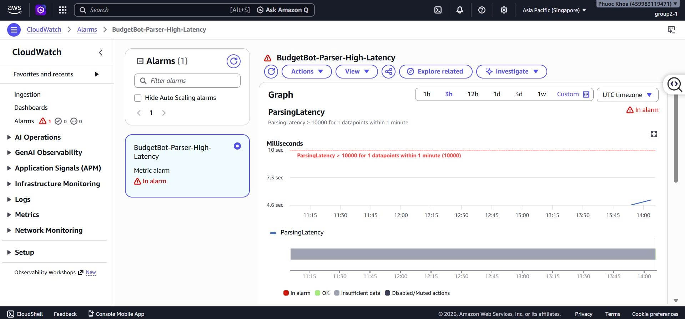
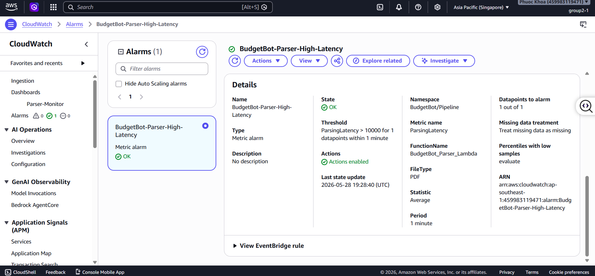
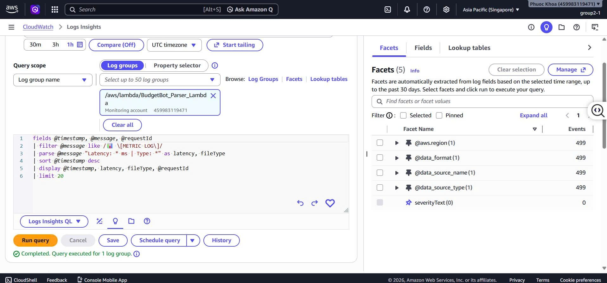
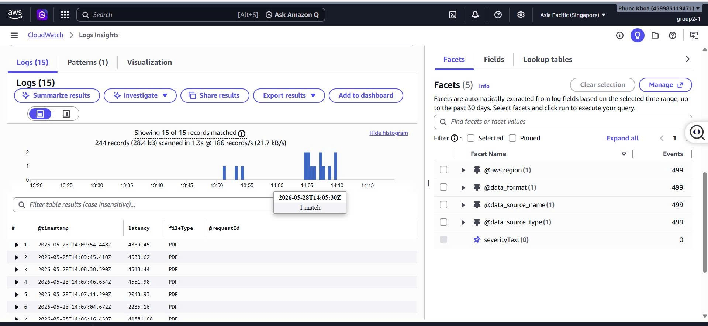

### 2.4. Consolidated Dashboard
All observability widgets are unified into a single operational console named `BudgetBot-Production-Monitor-Dashboard`. This dashboard provides a real-time, holistic view of pipeline health, including AI latency trends, system error rates, and active alarm statuses.

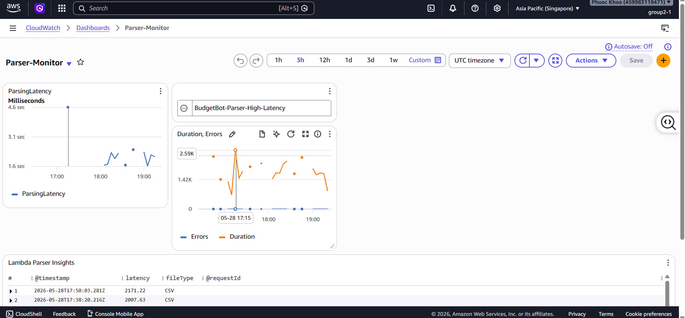

---

## 3. CONCLUSION & ARCHITECTURAL DECISIONS

By successfully implementing these two modules, the system definitively resolves its core technical challenges:
1. **Decoupling Decision:** Migrating from synchronous API Gateway processing to an S3 + SQS + Lambda event-driven pipeline ensures the web application never hangs or times out during heavy 5-second PDF extractions.
2. **AI Cost-Optimization Decision:** Injecting a heuristic `KEYWORD_MAPPING` layer before the Bedrock invocation successfully categorizes 60-70% of standard transactions at 0ms latency and $0 cost, reserving the LLM solely for complex context analysis.
3. **Security & Observability Decision:** Combining VPC Endpoints with Custom Metrics achieves "Full Observability" without exposing financial data streams to the public internet, strictly adhering to the Principle of Least Privilege.